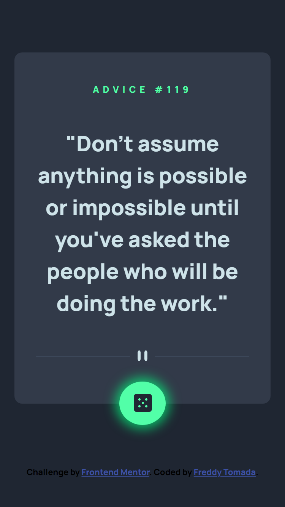

# Frontend Mentor - Advice generator app solution

This is a solution to the [Advice generator app challenge on Frontend Mentor](https://www.frontendmentor.io/challenges/advice-generator-app-QdUG-13db). Frontend Mentor challenges help you improve your coding skills by building realistic projects.

## Table of contents

- [Overview](#overview)
  - [The challenge](#the-challenge)
  - [Screenshot](#screenshot)
  - [Links](#links)
- [My process](#my-process)
  - [Built with](#built-with)
  - [What I learned](#what-i-learned)
  - [Continued development](#continued-development)
  - [Useful resources](#useful-resources)
- [Author](#author)
- [Acknowledgments](#acknowledgments)

**Note: Delete this note and update the table of contents based on what sections you keep.**

## Overview

### The challenge

Users should be able to:

- View the optimal layout for the app depending on their device's screen size
- See hover states for all interactive elements on the page
- Generate a new piece of advice by clicking the dice icon

### Screenshot

### Links

- Solution URL: 
- Live Site URL: 

## My process

### Built with

- Semantic HTML5 markup
- CSS custom properties
- Flexbox
- Mobile-first workflow
- [JQueary](https://jquery.com/) - JS library
- [SASS](https://sass-lang.com/) - SASS official page

### Continued development

I will continue learning how to make apps interacting with 3rd-party APIs.

## Author

- Website - [My Portfolio](https://ftdev-portfolio.netlify.app/)
- My GitHub - [@freddyval7](https://github.com/freddyval7)
- Frontend Mentor - [@freddyval7](https://www.frontendmentor.io/profile/freddyval7)
- Instagram - [@ftdev7](https://www.instagram.com/ftdev7/)
