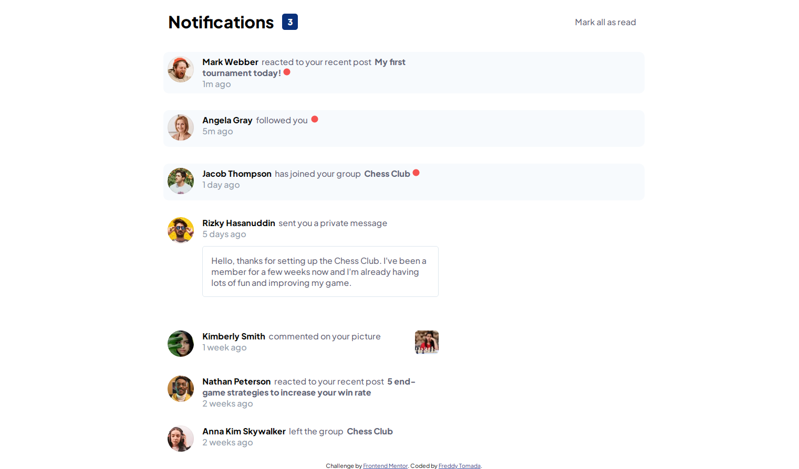
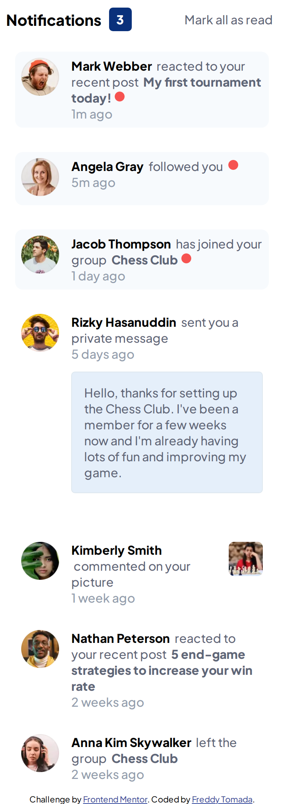

# Frontend Mentor - Notifications page solution

This is a solution to the [Notifications page challenge on Frontend Mentor](https://www.frontendmentor.io/challenges/notifications-page-DqK5QAmKbC). Frontend Mentor challenges help you improve your coding skills by building realistic projects. 

## Table of contents

- [Overview](#overview)
  - [The challenge](#the-challenge)
  - [Screenshot](#screenshot)
  - [Links](#links)
- [My process](#my-process)
  - [Built with](#built-with)
  - [What I learned](#what-i-learned)
  - [Continued development](#continued-development)
  - [Useful resources](#useful-resources)
- [Author](#author)
- [Acknowledgments](#acknowledgments)

**Note: Delete this note and update the table of contents based on what sections you keep.**

## Overview

### The challenge

Users should be able to:

- Distinguish between "unread" and "read" notifications
- Select "Mark all as read" to toggle the visual state of the unread notifications and set the number of unread messages to zero
- View the optimal layout for the interface depending on their device's screen size
- See hover and focus states for all interactive elements on the page

### Screenshot




### Links

- Live Site URL: [](notifications-main-page.netlify.app)

## My process

### Built with

- Semantic HTML5 markup
- CSS custom properties
- Flexbox
- Mobile-first workflow
- [JQueary](https://jquery.com/) - JS library
- [SASS](https://sass-lang.com/) - SASS official page

### What I learned

How to get a specific element in js using "this"

```html
<div class="notification__div">
  ...
    ...
      <ion-icon class="card__point" name="ellipse"></ion-icon>
```
```js
$(".notification--unread").click(function(){
    n-- 
    $(this).css("background-color","white")
    $(this).find(".card__point").hide()
    $(".notifications__div").text(`${n}`) 
})
```

### Continued development

Now I´m learning SASS and improving my html/css/js skills

### Useful resources

- [Selectors Optimazing](https://uniwebsidad.com/libros/fundamentos-jquery/capitulo-9/optimizacion-de-selectores) - This helped me to discover the find() in JQuery. I really liked this pattern and will use it going forward.

## Author

- My GitHub - [@freddyval7](https://github.com/freddyval7)
- Frontend Mentor - [@freddyval7](https://www.frontendmentor.io/profile/freddyval7)
- Instagram - [@ftdev7](https://www.instagram.com/ftdev7/)
